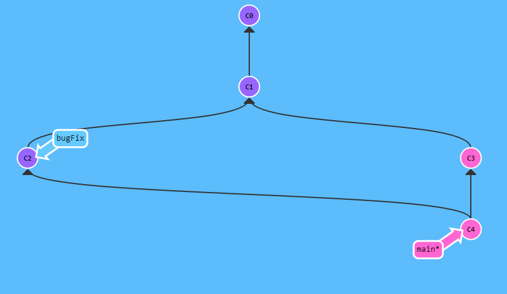
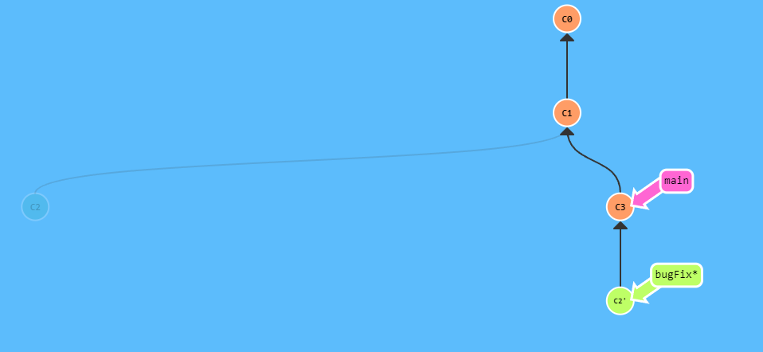

# Git-Study

## Git基础命令

`git clone` : 拉取git代码

`git branch <branchName>` ： 创建分支

`git checkout <branchName>`： 切换分支

`git checkout -b <branchName>`：创建分支并切换到此分支上

`git merge bugFix`：当前分支合并bugFix分支（merge会创建新节点去指向当前分支和bugFix分支）

`git rebase main`： 当前分支移动到main分支后面，形成一个线性流程

## Git提交树移动命令

`git checkout <git hashcode>`： 将HEAD指向提交记录而不是指向分支

`git checkout <branchName>^`：将分支指向分支的父提交记录，多个^可向上移动多次

`git checkout HEAD^`： 将HEAD指向上一次提交记录

`git checkout <git hashcode>^`： 指向某次提交记录(hash记录)的上一个提交记录

